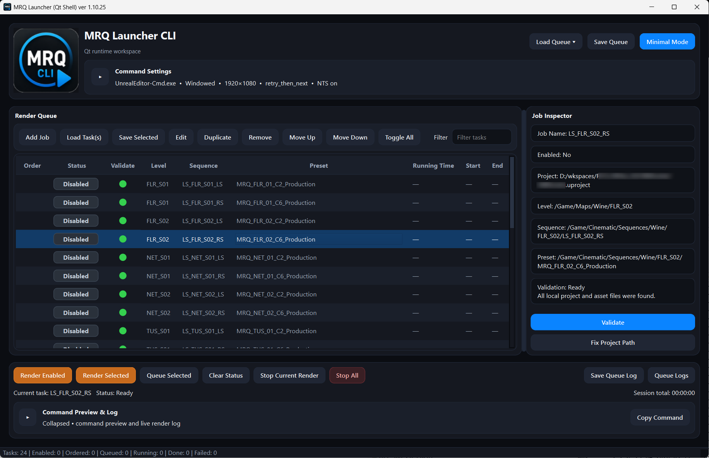
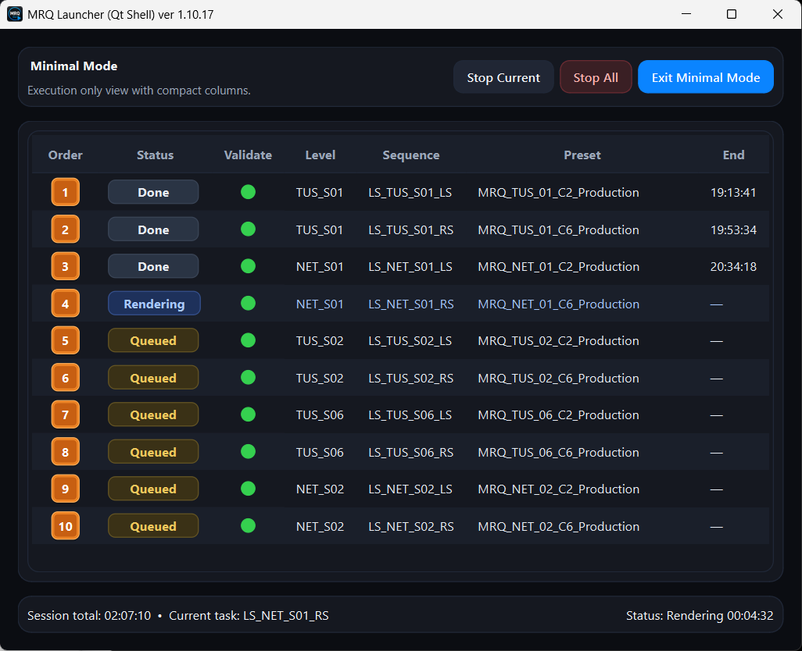
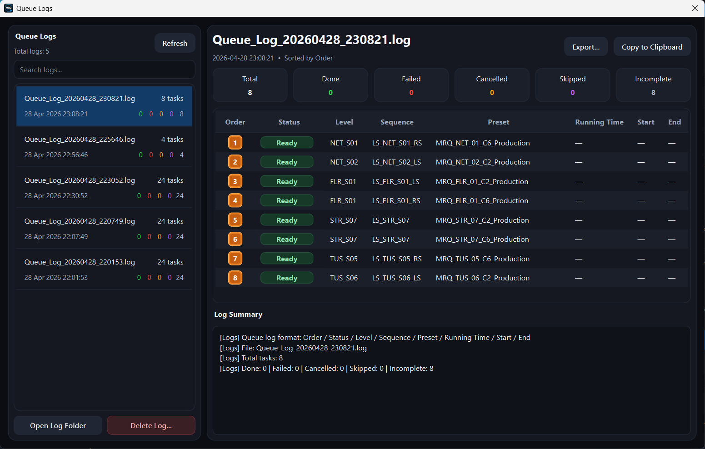

# MRQ Launcher (CLI)

**MRQ Launcher (CLI)** is a lightweight **Qt desktop launcher** for running **Unreal Engine Movie Render Queue (MRQ)** jobs through `UnrealEditor-Cmd.exe`, without opening the full Unreal Editor UI.

It is designed as a **version-agnostic Unreal Engine render launcher**. The app is not tied to one specific UE installation. Select the `UnrealEditor-Cmd.exe` from the engine version you want to use, load or create MRQ jobs, and run them as a controlled render queue from a clean desktop interface.

> Batch-render Unreal Engine Movie Render Queue jobs with a focused Qt UI, queue control, validation, Minimal Mode, and render logs.

---

## Current status

MRQ Launcher is now **Qt-only**.

The previous Tkinter UI has been removed. The normal source launch, batch launch, and packaged EXE now open the Qt launcher directly.

Current application version:

```text
1.10.25
```

---

## Screenshots

### Main Qt launcher



### Minimal Mode



### Queue Logs



---

## What it does

MRQ Launcher helps you manage and execute Unreal Engine MRQ render jobs from a standalone desktop tool.

Core features:

- Create and manage MRQ render jobs based on:
  - `.uproject`
  - Map / Level asset
  - Level Sequence asset
  - MRQ Preset asset
  - optional output directory
- Select any Unreal Engine version by pointing to its `UnrealEditor-Cmd.exe`.
- Load, save, and reuse full render queues as JSON.
- Import and export individual task files as `.task.json`.
- Add, edit, duplicate, remove, enable, disable, and reorder jobs.
- Validate project and asset paths before rendering.
- Prevent invalid or incomplete jobs from entering the runtime queue.
- Run selected, enabled, or all jobs through one controlled render queue.
- Append jobs to the active queue while rendering is already in progress.
- Prevent accidental parallel Unreal render processes from the launcher UI.
- Stop only the current render while keeping the remaining queue alive.
- Stop the whole queue when needed.
- Preview the generated Unreal command line before rendering.
- Save per-task logs and queue summary logs under `mrq_logs/`.
- Inspect saved queue logs from the built-in Queue Logs window.
- Use Minimal Mode as a compact monitoring view during long render sessions.

---

## Why use it

Unreal Engine MRQ can be automated from command line, but building and repeating those commands manually becomes painful when you have many shots, many maps, multiple engine versions, and overnight render queues.

MRQ Launcher provides a small production-focused layer around that workflow.

It is useful for:

- cinematic rendering
- batch MRQ jobs
- overnight render queues
- lighting artists
- technical artists
- virtual production / nDisplay-related render workflows
- small teams that need repeatable render execution
- projects that move between several Unreal Engine versions

---

## Unreal Engine compatibility

MRQ Launcher is intended to work with Unreal Engine versions that support command-line MRQ rendering through `UnrealEditor-Cmd.exe`.

The launcher does not hardcode one engine version. You choose the executable path for the engine you want to render with.

Example paths:

```text
C:/Program Files/Epic Games/UE_5.4/Engine/Binaries/Win64/UnrealEditor-Cmd.exe
C:/Program Files/Epic Games/UE_5.5/Engine/Binaries/Win64/UnrealEditor-Cmd.exe
C:/Program Files/Epic Games/UE_5.6/Engine/Binaries/Win64/UnrealEditor-Cmd.exe
C:/Program Files/Epic Games/UE_5.7/Engine/Binaries/Win64/UnrealEditor-Cmd.exe
```

Actual render behavior still depends on your Unreal project, selected engine build, MRQ preset, plugins, command-line support, and project configuration.

---

## Requirements

### Source version

- Windows
- Unreal Engine with `UnrealEditor-Cmd.exe`
- Python 3.9+
- PySide6

Install PySide6 if needed:

```bat
pip install PySide6
```

### Packaged EXE version

The packaged EXE includes the Python/PySide runtime through PyInstaller. Unreal Engine is still required separately.

---

## How to run from source

From the repository root, run:

```bat
mrq_launcherQt.bat
```

Or run the Python entrypoint directly:

```bat
python code\mrq_launcher.py
```

Both launch the Qt UI.

---

## Quick start

1. Launch MRQ Launcher.
2. Set the path to `UnrealEditor-Cmd.exe`.
3. Add a render job:
   - select your `.uproject`
   - select the Map / Level asset
   - select the Level Sequence asset
   - select the MRQ Preset asset
   - optionally set an output directory
4. Validate the queue.
5. Enable the jobs you want to render.
6. Check the render order.
7. Click **Render Enabled**, **Render Selected**, or **Render All**.
8. Use **Minimal Mode** during rendering if you want a compact monitoring window.
9. Inspect per-task logs or queue logs when the render finishes.

---

## Queue behavior

The launcher uses one controlled runtime queue.

Important behavior:

- Only one Unreal render process should run from the launcher at a time.
- **Render Selected** uses selected jobs.
- **Render Enabled** uses enabled jobs.
- **Render All** uses all jobs.
- **Queue Selected** uses selected jobs, or enabled jobs when nothing is selected.
- If rendering is already active, new jobs are appended to the existing queue.
- A second Unreal render process is not started by queue actions.
- Duplicate pending/running job objects are skipped.
- Disabled jobs are hidden in Minimal Mode.
- Invalid and incomplete jobs are blocked before queue entry.

---

## Render controls

Available render controls include:

- **Render Selected**
- **Render Enabled**
- **Render All**
- **Queue Selected**
- **Stop Current**
- **Stop All**
- **Minimal Mode**

### Stop Current

Stops only the currently running Unreal render process. The rest of the pending queue continues unless **Stop All** was requested.

### Stop All

Stops the current render and clears the remaining pending queue.

---

## Validation

Validation checks whether the required project and asset paths are usable before rendering.

Validation statuses include:

- `Ready`
- `Invalid`
- `Incomplete`
- `Unknown`
- `Not checked`

Blocking statuses:

- `Invalid`
- `Incomplete`

`Unknown` is treated as a warning by default. This can happen when the launcher cannot confidently resolve an asset path locally, for example with unsupported mount points.

Validation does not modify task paths automatically. The exception is explicit user action such as **Fix Project Path**.

---

## Saving and loading

### Queue JSON

Use queue JSON files to save and restore a full render setup.

A saved queue includes:

- render settings
- runtime options
- task list

Common actions:

- **Load Queue**
- **Save Queue**
- **Recent Queues**
- **Auto Load Last Queue**

Recent queues are stored in the user settings file, not inside the queue JSON.

### Task JSON

Individual task files use the `.task.json` extension.

You can:

- save selected jobs as task files
- load one or more task files into the current queue

Existing queue and task JSON files remain backward compatible.

---

## Logs

Logs are written under:

```text
mrq_logs/
```

The launcher writes two main kinds of logs.

### Per-task logs

Each rendered task writes a separate log containing:

- generated command line
- start time
- Unreal output stream
- end time
- exit code

### Queue summary logs

When a queue completes, the launcher auto-saves a queue summary log.

Queue summary logs use a compact execution snapshot:

```text
Order / Status / Level / Sequence / Preset / Running Time / Start / End
```

The **Queue Logs** window can list and display saved `Queue_Log_*.log` files.

---

## Minimal Mode

Minimal Mode is a compact execution view for monitoring active render jobs.

It shows only the most important queue information:

- Status
- Validate
- Level
- Sequence
- Preset
- Running Time

Minimal Mode keeps the render controls available:

- Stop Current
- Stop All
- Exit Minimal Mode

Disabled jobs are hidden in Minimal Mode so the view stays focused on the active render set.

---

## Command Preview

The launcher shows the generated Unreal command for the selected or currently running task.

The command is built from:

- `UnrealEditor-Cmd.exe`
- `.uproject`
- map path
- level sequence
- MRQ preset
- `-game`
- `-log`
- window/fullscreen option
- resolution
- texture streaming option
- extra CLI arguments
- optional output directory override

Command Preview and the actual render command use the same shared command construction logic.

---

## Building the Windows EXE

The repository includes:

```bat
buildQt_exe.bat
```

The build script creates or reuses a local `.venv`, installs build dependencies, and uses PyInstaller to build the Qt launcher.

### Build requirements

- Windows
- Python 3.9+ available from `python` in Command Prompt
- Internet access for the first build so `pip` can install dependencies
- Project resources:
  - `resources/app_icon.ico`
  - `resources/mrq_launcher_logo_167.png`

### How to build

From the repository root, run:

```bat
buildQt_exe.bat
```

### Build outputs

Successful builds are written to:

```text
dist/MRQLauncherQT/MRQLauncherQT.exe
dist/MRQLauncherQT.exe
```

The OneDir build is usually the safest option to distribute together with its generated folder:

```text
dist/MRQLauncherQT/MRQLauncherQT.exe
```

The OneFile build is easier to copy, but startup can be slower because PyInstaller extracts bundled files at launch:

```text
dist/MRQLauncherQT.exe
```

### Build troubleshooting

If the build fails, check:

```text
build_qt_log.txt
```

The batch file prints the last build log lines automatically. When reporting a build problem, include `build_qt_log.txt`.

---

## Repository layout

Important project paths:

```text
code/mrq_launcher.py
mrq_launcherQt.bat
buildQt_exe.bat
resources/app_icon.ico
resources/mrq_launcher_logo_167.png
docs/images/mrq_launcher_qt_full.png
docs/images/mrq_launcher_qt_minimal.png
docs/images/mrq_launcher_qt_log.png
mrq_logs/
```

---

## Documentation

Project documentation files:

```text
MRQ_TASK_SPEC_GUIDE.md
mrq_launcher_project_guardrails.md
BASELINE_BEHAVIOR.md
MRQ_QT_PARITY_AUDIT.md
README.md
```

These documents define the task format, protected runtime behavior, baseline behavior, and the completed Qt migration audit.

---

## Design principles

MRQ Launcher is intentionally focused.

Core rules:

- keep one active Unreal render process
- keep queue execution predictable
- preserve JSON compatibility
- keep validation blocking strict
- keep render command construction transparent
- keep logs easy to inspect
- avoid unnecessary dependencies
- keep the UI production-focused rather than overloaded

---

## License

MIT. Free to use, modify, and share.
